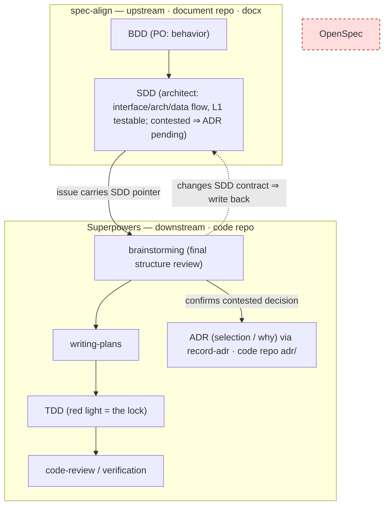
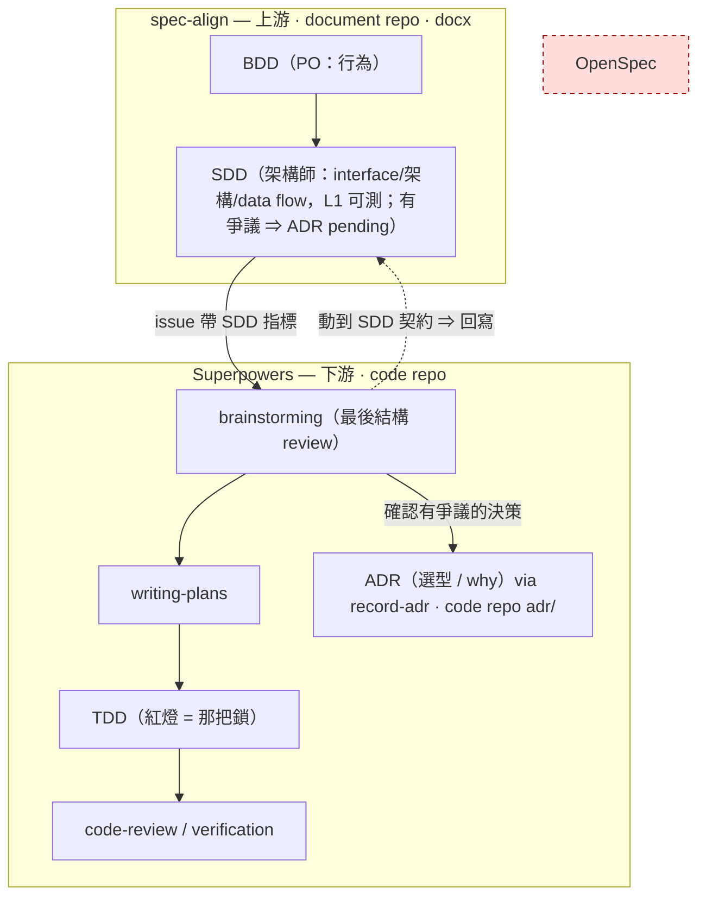

# ADR-0006 — spec-align: architecture-decision layer, SDD lock altitude, and downstream seam

**Status:** Proposed
**Date:** 2026-06-25
**Related:** [ADR-0001](ADR-0001-claude-framework-architecture.md) (framework), [ADR-0002](ADR-0002-grill-graph-decision-graph-skill.md) (decision-graph vs ADR granularity), record-adr skill, spec-align skill

---

## Context

`spec-align` runs a two-phase requirements → architecture workflow: Phase 1 grills the
product owner into BDD scenarios (PO language), Phase 2 grills the SWE into an SDD
(architect language). The artifacts are HTML → docx (pandoc) deliverables committed to
the `C-Sense/document` repo, plus GitHub issues for SWE/HWE.

Two gaps surfaced:

1. **Architecture selection evaporates.** Phase 2 already grills selection reasoning
   ("which BDD scenario does this serve?", "your plan assumes X, BDD says Y — which
   wins?", out-of-scope calls). But `sdd-template` only persists the *resulting* design
   (component design, data flow, HW/SW interface, acceptance criteria). The *why this
   architecture and not the alternatives* — the rejected options and their reasons — is
   produced during the grill and then thrown away. That discarded material is exactly
   ADR content, and the repo already has `record-adr` (graduate a decision into an ADR)
   and the ADR-0002 philosophy (dense decision trace vs sparse durable ADRs).

2. **SDD does not constrain implementation agents.** The stated goal is to lock
   interface / architecture / data flow so downstream implementation agents do not drift
   ("跑偏"). The current SDD is prose; prose guides but does not enforce.

The question raised: should Phase 2 be rewritten to emit / connect to **OpenSpec**
(Fission-AI's spec-driven-development tool: `specs/` source-of-truth + `changes/` delta
packages of `proposal.md` / `specs/` delta / `design.md` / `tasks.md`, living in the code
repo to drive AI coding agents)? OpenSpec spans the whole BDD→SDD→issues chain, so the
overlap is real. A second constraint then surfaced: the actual downstream implementation
already uses the **Superpowers workflow** (brainstorming → writing-plans →
executing-plans / subagent-driven-development, with TDD and code-review).

## Decision

Keep the three-layer split **BDD (PO / what-behavior) → SDD (architect / what-design) →
ADR (architect / why-selection)**, add the missing ADR layer via the existing `record-adr`
skill, lock the SDD at a concrete-but-testable altitude, and let TDD inside the
Superpowers downstream provide the enforcement. Do **not** adopt OpenSpec.

| Decision point | Option | Verdict | Reason |
|----------------|--------|---------|--------|
| Where does architecture selection live? | Inline-only table in SDD | Rejected | Selection never reaches `adr/` index, cannot be referenced cross-project, bypasses `record-adr` |
| | Rewrite Phase 2 to emit OpenSpec `design.md` | Rejected | OpenSpec `design.md` is free-form prose — same lossy "why-not-alternatives" gap as the SDD; relabels SDD, does not fix the actual problem |
| | **Thin `Architecture Decisions` section in SDD (adopted/rejected/why) linking to `adr/ADR-NNNN`; contested selections graduate via `record-adr` downstream in the code repo** | **Adopted** | Honours ADR-0002 (dense trace vs sparse durable); reuses `record-adr`; keeps docx/issues pipeline intact |
| Downstream spec/impl engine | Adopt OpenSpec in code repo | Rejected | Same niche as Superpowers but weaker — prose `design.md` + structural `openspec validate` (checks spec shape, not code-vs-design conformance) vs Superpowers' executable TDD; adopting it = three competing spec formats |
| | **Superpowers workflow (brainstorming → writing-plans → TDD → review)** | **Adopted** | Already in use; TDD is executable enforcement (red light blocks drift) — stronger than any prose contract |
| SDD lock altitude | L2: SDD emits schema/stub artifacts (OpenAPI / protobuf / type defs) | Rejected | The L2 enforcement muscle is already provided by downstream TDD; making spec-align emit code artifacts puts them in the wrong repo (document, not code) and over-weights Phase 2 |
| | L0: prose only | Rejected | Prose guides but does not pin interface/data-flow; agents drift |
| | **L1: real signatures/types in the interface table, named boundaries in data flow, acceptance criteria written as testable assertions** | **Adopted** | Concrete enough to seed the right TDD tests downstream; light enough to stay in the docx deliverable |
| SDD architecture-design structure | Free-form prose ("Component design" + "Data flow") | Rejected | No standard backbone; interface/dataflow under-specified and inconsistent across SDDs; nothing concrete for the grill to attack |
| | **IEEE 1016 design viewpoints — Composition / Interface / Interaction(data flow) — and a Phase 2 grill whose questions challenge each viewpoint** | **Adopted** | Industry-standard SDD backbone; forces interface signatures + typed dataflow; the grill attacks decomposition boundaries, interface contracts, and dataflow robustness instead of merely tracing scenarios |
| SDD section coverage vs industry SDD checklist | Add every common SDD section (component-internal algorithm, full tech stack, security, full test plan) | Rejected | Over-weights the upstream L1 contract and duplicates downstream Superpowers work — internals, TDD, and tooling live in the code repo |
| | **Add Data design (type dictionary) + Change log; fold tech choices into Architecture Decisions; leave internal algorithm, full test plan, and (for now) security to downstream / situational** | **Adopted** | The data dictionary makes the L1 lock real (it *defines* the `[Type]`s the viewpoints only *name*); the change log is the docx-visible history git can't show; everything else is either already an Architecture-Decisions row or deliberately downstream |
| SDD ↔ Superpowers coupling | (a) Tight: SDD acceptance → TDD test list, skip brainstorming, straight to writing-plans | Rejected | Removes the last structure/solution review against actual codebase reality |
| | **(b) Loose: SDD seeds Superpowers brainstorming, which is the final structure/solution-design review and correction gate** | **Adopted** | Brainstorming validates the SDD against codebase reality before implementation |
| Reconciling (b) with the no-drift goal | Brainstorming may silently change structure | Rejected | That *is* drift wearing the name "correction"; defeats the lock |
| | **Write-back rule: refine *within* the SDD contract freely; *changing* the contract (interface / boundary / data flow) requires writing back to the SDD (+ `record-adr` if it is a selection change)** | **Adopted** | Keeps SDD as source of truth; makes drift an explicit, recorded event instead of a silent local edit |

## Alternatives Considered

**OpenSpec as the downstream engine** was the most credible rejected option because it
genuinely spans BDD→SDD→issues and its `specs/` scenarios map cleanly onto BDD. It was
rejected on two independent grounds: (1) its `design.md` is as lossy as the SDD on
"why-not-the-alternatives", so it does not solve the selection-sedimentation gap; and
(2) it occupies the same niche as the already-adopted Superpowers workflow but enforces
with prose + structural validation rather than executable TDD. OpenSpec remains a valid
*future* choice **only** if implementation moves to an external agent that does not run
the Superpowers workflow — at which point it would live in the code repo, fed by
spec-align's issues, not as a Phase 2 rewrite.

**L2 machine-level SDD** (spec-align emitting OpenAPI/protobuf/type stubs) was attractive
for the "don't drift" goal but rejected: the enforcement it would provide is already
provided, more cheaply, by downstream TDD; emitting code artifacts from an upstream
document repo is the wrong altitude and the wrong repo.

## Consequences

**We gain:** architecture selection is preserved as durable ADRs instead of evaporating;
the SDD becomes a concrete, testable contract that seeds correct downstream tests; the
three tools occupy non-overlapping niches (spec-align locks the human + testable
contract, Superpowers enforces via TDD, ADR records the why); the docx/pandoc/issues
pipeline is untouched; the write-back rule turns would-be silent drift into a recorded
event.

**We sacrifice:** Phase 2 grows an extra output step (graduate selections via
`record-adr`) and the SDD template grows a section; the write-back rule imposes
discipline on the downstream brainstorming step (a contract change is no longer a free
local edit); graduation is split across repos — the SDD (document repo) marks a contested
decision `pending` and the ADR lands later in the code repo, so the link is dangling until
the downstream graduates it.

## Resolved Questions

1. **ADR location — the implementing code repo, not the document repo.** Graduated ADRs are
   written to the implementing code repo's `adr/` (record-adr's default), close to the code
   and the developers who maintain it. Because spec-align runs upstream where the code repo
   is not yet in context, graduation is **deferred to the downstream seam**: Superpowers
   brainstorming confirms the contested decision against codebase reality, then `/record-adr`
   writes `adr/ADR-NNNN-<slug>.md` and updates `adr/README.md` there. Until graduated the
   SDD's Architecture Decisions row carries `ADR: pending`. (This reverses the earlier
   co-location option: developer proximity won over keeping SDD↔ADR in one docx deliverable —
   arc42 §9 co-location was outweighed by the fact that the people who later need the
   rationale work in the code repo, not the document repo.)
2. **Graduation threshold — contested only.** Graduate a decision to an ADR **only when a
   real alternative was seriously weighed and rejected for a non-obvious reason**; everything
   else stays inline in the SDD's Architecture Decisions table. Inline = dense cheap trace;
   ADR = sparse durable decision (ADR-0002). (The earlier "durable & cross-context" and
   "expensive to reverse" triggers were dropped as separate criteria — they tend to coincide
   with "contested", and a single sharp criterion keeps ADRs genuinely sparse.)

---

---

# ADR-0006 — spec-align：架構選型層、SDD 鎖定高度與下游接縫

**狀態：** 提議中
**日期：** 2026-06-25
**相關：** [ADR-0001](ADR-0001-claude-framework-architecture.md)（框架）、[ADR-0002](ADR-0002-grill-graph-decision-graph-skill.md)（決策圖 vs ADR 粒度）、record-adr skill、spec-align skill

---

## 背景

`spec-align` 跑一條兩階段的需求 → 架構流程：Phase 1 拷問產品負責人產出 BDD scenarios
（PO 語言），Phase 2 拷問 SWE 產出 SDD（架構師語言）。產物是 HTML → docx（pandoc）
交付物，commit 進 `C-Sense/document` repo，外加給 SWE/HWE 的 GitHub issues。

浮現兩個缺口：

1. **架構選型蒸發。** Phase 2 其實已經在拷問選型推理（「這決策服務哪個 BDD scenario？」
   「你的 plan 假設 X、BDD 說 Y，誰優先？」、out-of-scope 判定）。但 `sdd-template` 只
   沉澱**結果**（component design、data flow、HW/SW interface、acceptance criteria）。
   「為何是這個架構而非別的」——被否決的選項與理由——在拷問當下產生、隨即丟棄。那團
   被丟掉的東西正是 ADR 內容，而 repo 已有 `record-adr`（把決策畢業成 ADR）與 ADR-0002
   的哲學（密集決策軌跡 vs 稀疏耐久 ADR）。

2. **SDD 約束不住實作 agent。** 目標是鎖住 interface／架構／data flow，讓下游實作 agent
   不跑偏。現在的 SDD 是散文；散文導引、但不強制。

引發的提問：Phase 2 是否該改寫成吐出／串接 **OpenSpec**（Fission-AI 的 spec-driven
development 工具：`specs/` 真相來源 + `changes/` delta 套件含 `proposal.md`／`specs/`
delta／`design.md`／`tasks.md`，活在 code repo 裡驅動 AI coding agent）？OpenSpec 橫跨整條
BDD→SDD→issues 鏈，重疊是真的。接著浮現第二個約束：實際下游實作**已經在用 Superpowers
workflow**（brainstorming → writing-plans → executing-plans／subagent-driven-development，
含 TDD 與 code-review）。

## 決策

維持三層切分 **BDD（PO／行為）→ SDD（架構師／設計）→ ADR（架構師／選型 why）**，用既有
`record-adr` 補上缺的 ADR 層，把 SDD 鎖在「具體但可測」的高度，並讓 Superpowers 下游裡的
TDD 提供強制力。**不**採用 OpenSpec。

| 決策點 | 選項 | 結論 | 理由 |
|--------|------|------|------|
| 架構選型放哪 | 只在 SDD 內嵌表 | 否決 | 選型進不了 `adr/` 索引、無法跨專案被引用、繞過 `record-adr` |
| | 改寫 Phase 2 吐 OpenSpec `design.md` | 否決 | OpenSpec `design.md` 是自由散文——跟 SDD 一樣有「為何不選別的」損失；只是把 SDD 改名，沒解到真問題 |
| | **SDD 加薄 `Architecture Decisions` 段（採納/否決/理由）連到 `adr/ADR-NNNN`；有爭議的選型於下游 code repo 用 `record-adr` 畢業** | **採納** | 守 ADR-0002（密集軌跡 vs 稀疏耐久）；重用 `record-adr`；docx/issues 管線不動 |
| 下游 spec／實作引擎 | code repo 採用 OpenSpec | 否決 | 與 Superpowers 同生態位但較弱——散文 `design.md` + 結構性 `openspec validate`（檢查 spec 形狀、非 code 對 design 的符合）vs Superpowers 的可執行 TDD；採用它 = 三套規格格式打架 |
| | **Superpowers workflow（brainstorming → writing-plans → TDD → review）** | **採納** | 已在用；TDD 是可執行強制（紅燈擋 drift）——強過任何散文契約 |
| SDD 鎖定高度 | L2：SDD 吐 schema/stub（OpenAPI／protobuf／型別定義） | 否決 | L2 強制力下游 TDD 已提供；讓 spec-align 吐 code 產物會落在錯的 repo（document 非 code）、且 Phase 2 過重 |
| | L0：只有散文 | 否決 | 散文導引但釘不住 interface/data-flow；agent 跑偏 |
| | **L1：interface 表填真實簽章/型別、data flow 標命名邊界、acceptance 寫成可測斷言** | **採納** | 夠具體能 seed 下游正確的 TDD 測試；夠輕能留在 docx 交付物裡 |
| SDD 架構設計結構 | 自由散文（「Component design」+「Data flow」） | 否決 | 沒有標準骨架；interface/dataflow 規格不足、跨 SDD 不一致；grill 沒有具體東西可攻 |
| | **IEEE 1016 設計觀點——Composition／Interface／Interaction(data flow)——且 Phase 2 grill 的問題挑戰每個觀點** | **採納** | 業界標準 SDD 骨架；強制 interface 簽章 + typed dataflow；grill 攻擊分解邊界、介面契約、dataflow 韌性，而非只追溯 scenario |
| SDD 區塊覆蓋 vs 業界 SDD 清單 | 補齊所有常見區塊（元件內部演算法、完整工具鏈、security、完整 test plan） | 否決 | 讓上游 L1 契約過重,且與下游 Superpowers 重複——內部設計、TDD、工具鏈活在 code repo |
| | **加 Data design（型別字典）+ Change log；技術選擇併進 Architecture Decisions；內部演算法、完整 test plan、（暫時）security 留下游／視情況** | **採納** | 型別字典讓 L1 鎖真正成立（它**定義**了 viewpoint 只**命名**的 `[Type]`）；change log 是 git 顯示不了的 docx 可見歷史；其餘不是已是 Architecture-Decisions 列就是刻意下游 |
| SDD ↔ Superpowers 耦合 | (a) 緊：SDD acceptance → TDD 測試清單、跳過 brainstorming、直奔 writing-plans | 否決 | 拿掉了對照實際 codebase 的最後結構/方案 review |
| | **(b) 鬆：SDD seed Superpowers brainstorming，brainstorming 當最後結構/方案 review 與修正關卡** | **採納** | brainstorming 在實作前對照 codebase 現實驗證 SDD |
| (b) 與不跑偏目標的調和 | brainstorming 可默默改結構 | 否決 | 那**就是** drift 披著「修正」的皮；瓦解了鎖 |
| | **回寫規則：在 SDD 契約**內**精煉可自由；**改**契約（interface／邊界／data flow）須回寫 SDD（若為選型變動再 `record-adr`）** | **採納** | 維持 SDD 為真相來源；把 drift 變成明確、被記錄的事件，而非默默地端編輯 |

## 備選方案

**OpenSpec 當下游引擎**是最有說服力的被否決選項，因為它確實橫跨 BDD→SDD→issues、且其
`specs/` scenarios 乾淨對映 BDD。否決基於兩個獨立理由：(1) 它的 `design.md` 在「為何不選
別的」上跟 SDD 一樣有損，沒解到選型沉澱缺口；(2) 它與已採用的 Superpowers 同生態位，卻用
散文 + 結構驗證強制，而非可執行 TDD。OpenSpec **僅**在實作哪天轉給不跑 Superpowers 的外部
agent 時才是有效**未來**選項——屆時它會活在 code repo、由 spec-align 的 issue 餵，而非
Phase 2 改寫。

**L2 機器級 SDD**（spec-align 吐 OpenAPI/protobuf/型別 stub）對「不跑偏」目標很誘人，但
否決：它要提供的強制力，下游 TDD 已更便宜地提供；從上游文件 repo 吐 code 產物是錯的高度、
錯的 repo。

## 後果

**獲得：** 架構選型保存為耐久 ADR 而非蒸發；SDD 成為具體、可測的契約，能 seed 下游正確
測試；三個工具各守不重疊生態位（spec-align 鎖人＋可測契約、Superpowers 用 TDD 強制、ADR
記 why）；docx/pandoc/issues 管線不動；回寫規則把本會默默發生的 drift 變成被記錄的事件。

**犧牲：** Phase 2 多一個 output 步驟（用 `record-adr` 畢業選型）、SDD 模板多一段；回寫
規則對下游 brainstorming 施加紀律（改契約不再是免費地端編輯）；畢業被拆到兩個 repo——SDD
（document repo）標 `pending`、ADR 之後才落 code repo,所以連結在下游畢業前是懸空的。

## 已解決問題

1. **ADR 落點——實作 code repo，不是 document repo。** 畢業的 ADR 寫到實作 code repo 的
   `adr/`（record-adr 預設），離 code 與維護它的開發者近。因為 spec-align 跑在上游、那時
   code repo 還沒在 context 裡,畢業**遞延到下游接縫**：Superpowers brainstorming 對照
   codebase 現實確認有爭議的決策後,在那裡跑 `/record-adr` 寫 `adr/ADR-NNNN-<slug>.md` 並
   更新 `adr/README.md`。畢業前 SDD 的 Architecture Decisions 該列標 `ADR: pending`。
   （此處反轉了先前的「同處 document repo」選項：離 code 近勝出——arc42 §9 的同處被一個事實
   壓過：之後需要這份理由的人是在 code repo 工作,不是 document repo。）
2. **畢業門檻——只看「有爭議」。** 只有當一個真實替代方案被認真權衡、並因非顯而易見的理由
   被否決時,才把決策畢業成 ADR；其餘一律留在 SDD 的 Architecture Decisions 內嵌表。內嵌＝
   密集廉價軌跡；ADR＝稀疏耐久決策（ADR-0002）。（先前的「耐久且跨情境」與「難以反轉」不再
   當獨立判準——它們通常與「有爭議」重合,單一銳利判準讓 ADR 真正稀疏。）
