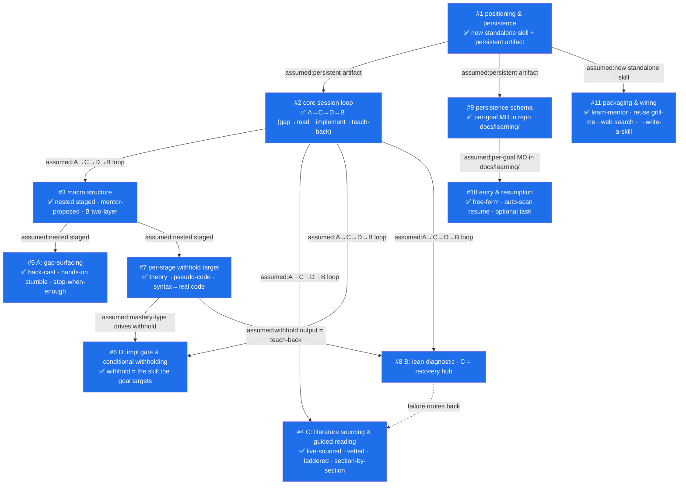

# Decision Graph — Learning Mentor Skill

> Live topology SSOT for the `learn-mentor` skill design.
> Reading order (node id) = time axis. Converges into `spec.md`.

## Nodes

### #1 — Skill positioning & persistence

- **Question:** Is this a new standalone skill, and does it maintain a persistent learning artifact across sessions?
- **Status:** resolved
- **Options:**
  - ✅ **New standalone skill + persistent learning artifact** *(adopted)* — built on the grill-family interrogation core but with inverted posture (teach, don't complete). Maintains a cross-session "mastery map / glossary / read-papers list" analogous to how grill-graph persists `decision-graph.md`.
  - ❌ Ephemeral conversational mentor *(rejected)* — "true mastery" requires cross-session accumulation; a stateless mentor restarts from zero each time and cannot track what the user still hasn't understood.
  - ❌ Branch/variant inside grill-me *(rejected)* — the anti-goal ("don't just complete the task") is a different posture than any existing skill; different persisted artifact (knowledge map, not decision tree).

### #2 — Core session loop (pedagogical spine)

- **Question:** What is the primary loop each session runs, and in what order?
- **Status:** resolved
- **Depends on:** #1 (assumed: persistent artifact)
- **Options:**
  - ✅ **A → C → D → B** *(adopted)* — entry point is the user's *learning goal + task*, not a known concept. (A) Socratic interrogation first, to surface gaps the user can't name themselves; (C) literature-guided reading to fill each gap; (D) implementation to confirm a **stage goal** is reached; (B) Feynman teach-back as final confirmation the user truly knows what they're doing.
  - ❌ C-trunk: C primary + B verify + D refusal-posture *(rejected)* — assumes the user already knows *which* concept to study. In reality the user only knows their goal+task; gaps must be surfaced (A) before reading (C) is even targetable.
  - ❌ Single paradigm (pure Socratic A, or pure teach-back B) *(rejected)* — no single paradigm covers the full arc from "don't know what I lack" to "can implement and explain it."

### #3 — Macro structure: staging

- **Question:** Does the loop run once over the whole goal, or is the goal decomposed into stages each running its own loop?
- **Status:** resolved
- **Depends on:** #2 (assumed: A→C→D→B loop)
- **Options:**
  - ✅ **Nested staged** *(adopted)* — entry is goal+task; mentor decomposes the goal into N stages, each bound to one implementable **stage goal**. Each stage runs A→C→D plus a **lightweight B** (recall the stage's core). After all stages, one **heavyweight B** confirms cross-stage mastery. Sub-decisions: (a) decomposition is **mentor-proposed, user-confirmed** (collaborative); (b) **B is two-layer** (per-stage light + terminal heavy).
  - ❌ Flat single-pass *(rejected)* — a large goal makes A emit dozens of unfocused gaps, C reading loses focus, and D's "stage goal" has nowhere to anchor.

### #4 — C phase: literature sourcing & guided reading

- **Question:** How does C find/vet "genuinely helpful" sources, and how does it guide reading for someone who doesn't know the jargon/math?
- **Status:** resolved
- **Depends on:** #2 (assumed: A→C→D→B loop)
- **Options:**
  - ✅ **Live-sourced, vetted, laddered, section-by-section** *(adopted)* — three sub-decisions all adopted:
    - **(a) Channel:** live WebSearch + WebFetch as primary (mentor actively finds), plus the user may drop their own paper/URL anytime. No fixed pre-bound corpus.
    - **(b) Vetting rubric:** prefer primary source / canonical classics / authoritative texts; check author authority, fit-to-current-gap, difficulty match. Every pick records a one-line "why chosen" in the knowledge graph; user can reject and request a re-search.
    - **(c) Laddered, section-by-section:** for each gap, an accessible **explainer first** (plain-language intuition), then the authoritative **primary source** (depth). Read **section-by-section**, decoding jargon/syntax/math inline; user confirms understanding per section before advancing.
  - ❌ Direct primary-source assault with heavy mentor translation *(rejected)* — for a learner who doesn't know the jargon/math, dropping a primary paper cold is the #1 cause of "read but couldn't understand, then gave up." The ladder makes the primary source climbable instead of a deterrent wall.

### #5 — A phase: gap-surfacing mechanism

- **Question:** How does A surface real gaps when the user can't name what they lack?
- **Status:** resolved
- **Depends on:** #3 (assumed: nested staged — back-casting needs a stage goal to aim at)
- **Options:**
  - ✅ **Back-cast + hands-on stumble + stop-when-enough** *(adopted)*:
    - **(a) Anchor:** back-cast prerequisites from the **stage goal** — mentor derives "what must be understood to hit this stage goal," then probes each, instead of asking open-endedly.
    - **(b) Style:** make the user **attempt or explain in their own words**, not recite definitions. Gaps emerge from where they stumble or get vague — consistent with "you can't self-assess unknown unknowns."
    - **(c) Depth:** **stop when enough** gaps to fill the stage are found; no exhaustive interrogation. Output = a ranked **gap list** for the stage, written to the knowledge graph, becoming C's reading agenda.
  - ❌ Mentor lists prerequisites, user self-assesses which they don't know *(rejected)* — the user already said they don't know what they lack; self-assessment can't surface unknown unknowns.

### #6 — D phase: implementation gate & conditional withholding

- **Question:** How does D let the user reach the stage goal by their own hand while refusing to just-complete it?
- **Status:** resolved
- **Depends on:** #2 (assumed: A→C→D→B loop); consumes the per-stage mastery-type from #7
- **Options:**
  - ✅ **Conditional withholding driven by the learning goal** *(adopted)* — the mentor withholds *exactly the skill the stage goal targets*, and may supply the rest as scaffolding:
    - learning goal = the language/syntax itself → code **is** the target → not given, user writes it (hint ladder applies: escalating hints only on request, never a finished artifact).
    - learning goal = theory (transformers, fine-tuning) where code is mere plumbing → mentor **may supply code** so the user's cognition focuses on the concept, not the boilerplate.
    - **(b) Acceptance criteria** *(tentative)*: each stage goal carries explicit criteria; D checks the user's work against them; a resurfaced gap loops back to C.
  - ❌ Absolute "user writes everything" *(rejected)* — over-withholds when code isn't the learning target, burning cognition on plumbing instead of the concept the user actually came to learn.

### #7 — Per-stage withhold target (mastery-type)

- **Question:** At what granularity is "what to withhold" decided, and what is the production bar per type?
- **Status:** resolved
- **Depends on:** #3 (assumed: nested staged, mentor-proposed). **Feeds:** #6 (D consumes the tag).
- **Options:**
  - ✅ **Per-stage withhold tag, tagged during decomposition** *(adopted)*:
    - **(a) Granularity:** per stage — a multi-stage goal mixes types (e.g. early "understand attention math" = theory; later "implement attention forward pass" = production). One global tag would conflate them.
    - **(b) Timing:** tagged during #3 decomposition; user confirms the tag when confirming the stage.
    - **Production bar by type:**
      - syntax/language goal → user produces **real working code** (code is the target).
      - theory goal (transformer, fine-tuning) → user produces **pseudo-code of the core mechanism**; mentor may supply runnable plumbing. Pseudo-code doubles as the stage's **lightweight teach-back** (bridges to B).
    - **(c)** D's target defaults to a **real-task slice**; the tag governs which part is the user's.
  - ❌ Single global classification *(rejected)* — conflates theory stages and implementation stages under one discipline.

### #8 — B phase: teach-back as lean diagnostic, C as recovery hub

- **Question:** How does B judge real understanding, and what happens on failure?
- **Status:** resolved
- **Depends on:** #2 (assumed: A→C→D→B loop); #7 (assumed: withhold output reused as teach-back material)
- **Key reframe (user):** the skill's center of gravity is **C**; B is **lean**, not a gating exam.
- **Options:**
  - ✅ **B is a lean diagnostic; failure routes primarily back to C** *(adopted)*:
    - **(a) Light B (per stage):** reuse #7's withhold output (pseudo-code for theory / working code + rationale for syntax) plus 1–2 "why / what-if" probes — a low-cost "got-it?" probe.
    - **(b) Heavy B (terminal):** retained but positioned as **diagnostic, not a gate** — walk the **seams between stages** (where synthesis usually breaks) to locate *which C material to revisit*, not to block the user.
    - **(c) On failure → mainly back to C:** localize the exposed gap to its source passage and re-read; do **not** force a full A/D re-run. C is the recovery hub. Knowledge graph records mastery transitions (unknown → reading → implemented → explained, reversible).
  - ❌ Heavyweight terminal exam as a hard gate *(rejected)* — over-weights B; the user's priority is reading-to-mastery (C), so B should detect-and-route, not block.

### #9 — Persistence schema & location

- **Question:** What does the knowledge artifact store, at what granularity, where, and in what format?
- **Status:** resolved
- **Depends on:** #1 (assumed: persistent artifact)
- **Stored content (derived from prior nodes):** learning goal + task; stage decomposition (per stage: stage goal / acceptance criteria / withhold tag); per-stage gap list (A); per-gap chosen sources (explainer + primary, with "why chosen"); section-by-section reading progress; **glossary of terms** (the user's chief pain — jargon); per-gap mastery state (unknown → reading → implemented → explained, reversible); teach-back records.
- **Options:**
  - ✅ **Per-goal Markdown file, sedimented into the repo's `docs/`** *(adopted)*:
    - **(a) Granularity:** one file per learning goal — `docs/learning/<goal-slug>.md` — many topics over time shouldn't share one file.
    - **(b) Location:** always **repo-local `docs/`** — learning records settle with the project they serve (the skill is meant to run inside the project repo motivating the learning). Created lazily (repo currently has no `docs/`; ADRs live in `adr/`).
    - **(c) Format:** Markdown + embedded Mermaid (stage→gap→mastery live map) + glossary table + mastery-state legend. Zero-build, human-readable, consistent with the existing skill ecosystem.
  - ❌ Dual-mode (repo-local + global `~/.claude/learning/`) *(rejected)* — user wants a single clear home so knowledge sediments with the project; dual-mode adds branching with no payoff.
  - ❌ Global-only `~/.claude/learning/` *(rejected)* — separates learning from the project it serves; user explicitly wants it to settle in-repo.

### #10 — Entry declaration & cross-session resumption

- **Question:** How does the user start a session and hand over goal+task, and how does it resume prior progress?
- **Status:** resolved
- **Depends on:** #9 (assumed: per-goal MD in repo docs/learning/)
- **Options:**
  - ✅ **Free-form entry + auto-scan resume + optional task** *(adopted)*:
    - **(a)** Free-form "learning goal + task" prose; mentor parses goal/task, infers domain, proposes a `<goal-slug>` for confirmation (→ `docs/learning/<slug>.md`).
    - **(b)** On start, scan `docs/learning/`: existing file → **auto-resume** from the un-mastered frontier stage, announcing "currently stage N, next: X" (RESUME.md-style); none → enter #3 decomposition. User can redirect/restart anytime.
    - **(c)** Task is **optional but strongly encouraged** — a real task gives D's "real-task slice" something to grip; pure-theory exploration is allowed (D degrades to pseudo-code practice), with a nudge to bind a task.
  - ❌ Rigid form + manual "resume or restart?" prompt every time *(rejected)* — friction against the lightweight style; auto-resume with announcement already lets the user redirect.

### #11 — Packaging & ecosystem wiring

- **Question:** What is the skill named, how is it packaged, and how does it wire into the existing ecosystem?
- **Status:** resolved
- **Depends on:** #1 (assumed: new standalone skill)
- **Options:**
  - ✅ **`learn-mentor`, reuse + compose existing skills** *(adopted)*:
    - **(a) Name:** `learn-mentor` (verb-first, third-person describable, no clash with grill family).
    - **(b) Wiring:** A-phase reuses grill-me's relentless-interrogation prose core (same lineage, no re-build); C-phase uses **WebSearch + WebFetch**; **no** auto-coupling to record-adr; **optional** architecture-diagram for a polished final panorama (default = embedded Mermaid); downstream this grill's `spec.md` → **write-a-skill** generates the actual skill.
    - **(c) Graduation:** learning nodes **never** graduate to ADR — they record "what I understood," not "why we designed the system this way."
    - **Packaging checklist:** `plugins/learn-mentor/.claude-plugin/plugin.json`; `plugins/learn-mentor/skills/learn-mentor/SKILL.md`; entry in `.claude-plugin/marketplace.json` plugins array; `"learn-mentor@leayeh-skills": true` in `settings.json`.
  - ❌ Auto-couple to record-adr / build a fresh interrogation engine *(rejected)* — semantics don't match ADRs; grill-me's core is reusable as-is.

## Diagram

