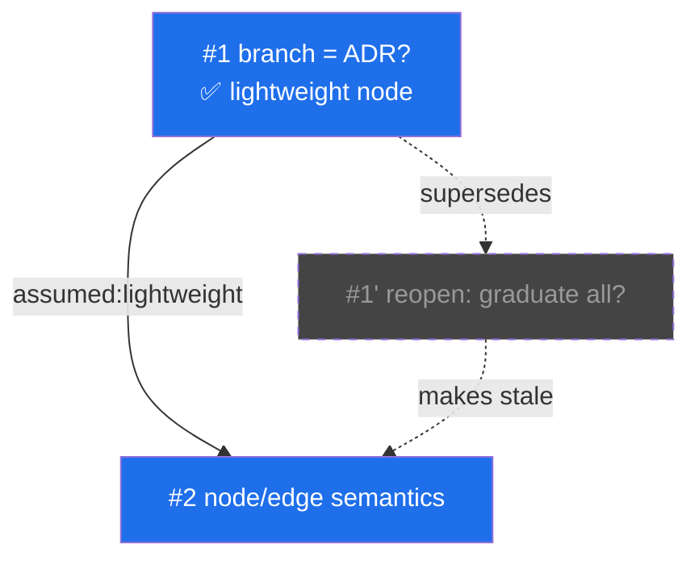

<what-to-do>

Interview me relentlessly about every aspect of this plan until we reach a shared understanding. Walk down each branch of the design tree, resolving dependencies between decisions one-by-one. For each question, provide your recommended answer.

Ask the questions one at a time, waiting for feedback on each question before continuing.

If a question can be answered by exploring the codebase, explore the codebase instead.

The difference from plain grilling: as decisions resolve, you maintain a **decision graph** on disk so that branches, rejections, back-references, and re-assumptions are never lost. At the end you converge the graph into a `spec.md`.

</what-to-do>

<supporting-info>

## The artifact chain

```
decision-graph.md   ← grown live during grilling · the topology SSOT · embedded Mermaid
   │ converge: take adopted options of active + resolved nodes
   ▼
spec.md             ← ⚠️ Unresolved Premises + adopted decisions (each with its rejection reason) + final panorama diagram
   │ hand off
   ▼
to-prd / to-issues  ← existing skills, not re-implemented here
```

Create `decision-graph.md` lazily — only once the first decision is resolved. Default location: repo root, or `docs/` if it exists. Write to it **inline** as decisions resolve; do not batch.

## Data model

A **node** is a *resolved decision point* (not a bare question — a question carries no "why rejected", and that reason is the whole point).

```
Node
  id:       sequential integer (#1, #2, ...) — reading order IS the time axis
  question: the decision being made
  status:   resolved | stale | abandoned
  options:  [ { name, verdict: adopted | rejected, reason } ]
```

An **edge** is a *dependency* and carries the upstream option it assumes:

```
Edge { from: <node id>, assumed_option: <name>, to: <node id> }
```

`assumed_option` is load-bearing: it is what lets re-assumption propagate precisely (see below).

## The grilling loop

After each answer:

1. **Resolve the current node** — record the adopted option AND every rejected option with its reason. Append/update the node in `decision-graph.md`.
2. **Draw the edge** from the parent decision, tagged with the `assumed_option` it depends on.
3. **Decide where the next question attaches.** A follow-up question does NOT always hang off the current node. The user may raise a counter-question that reaches back to an *arbitrary earlier node* to extend it. When that happens, attach the new node to the node it actually depends on, not the frontier.
4. **Detect re-assumption.** If an answer reopens an earlier decision (changes its adopted option), see the next section.
5. **Surface the stale queue** (advisory — see below) before moving to genuinely new ground.
6. **Update the embedded Mermaid diagram** so the live overview stays current.

Rejected options rarely sprout their own subtree — when one does and is later dropped, mark that subtree `abandoned`. The common and important case is back-references and re-assumptions, not dead sibling subtrees. Don't over-model dead siblings.

## Re-assumption and stale propagation

When the user reopens an earlier node and its adopted option changes:

1. Record the change: the old node becomes `stale`/superseded; create the new version and link `old -.supersedes.-> new`.
2. **Propagate automatically.** Walk the dependency edges whose `assumed_option` equals the option that just changed. Every downstream node reachable through those edges is marked `stale` and pushed onto a **revisit queue**.
3. **The queue is advisory, never a gate.** Surface the stale nodes — "these premises changed: revisit, or keep as-is?" — but the user may batch-skip all of them. Skipped nodes stay `stale` and stay visible in the graph. The contradiction is never silently swallowed; the user just chooses not to act on it yet.

## Graduation to ADR

Most nodes never become ADRs — they are small, reversible, no real trade-off. Only graduate a node when all three hold (same bar as record-adr): hard to reverse, surprising without context, the result of a real trade-off.

When a node graduates, invoke the **record-adr** skill. The ADR's `Related:` field is a *projection* of the graph: walk up from the node to the nearest ancestor that is *also* graduated, and link that ADR. Intermediate non-graduated nodes are compressed away, so graduated ADRs form a sparse high-level view — but `decision-graph.md` remains the single source of truth for topology. ADR parent links are never hand-maintained independently of the graph.

## Visualization

`decision-graph.md` embeds a Mermaid `graph TD`, refreshed live (the simple, zero-build overview the user reads any time). Encoding:

- **Node label** = `#<id> <short question><br/>✅ <adopted option>`
- **Number = time axis** — there is no time-machine/replay; sequential ids carry the evolution.
- **Color = status:** active = blue fill, stale = grey dashed, graduated = gold border.
- **Edge label** = `assumed:<option>` so each dependency shows the premise it stands on.
- **`-.supersedes.->`** dashed edge from an old node to its re-assumed replacement, preserving "we once thought this".



For a polished final panorama at convergence time, invoke the **architecture-diagram** skill and save the output alongside `spec.md`.

## Convergence

When the user calls for convergence, walk the DAG and emit `spec.md`:

1. **⚠️ Unresolved Premises** (top of file) — list every `stale` or unanswered node. Convergence is NOT gated on these; surface them, don't block. This mirrors the "stale is batch-skippable" philosophy.
2. **Adopted decisions** in dependency order — each adopted option with a one-line "chosen because … / rejected …" rationale carried from the node.
3. **Final panorama** — the embedded (or architecture-diagram) graph.

Then hand off: offer **to-prd** or **to-issues** to take `spec.md` downstream. Do not re-implement PRD/issue generation here.

## Relationship to sibling skills

- **grill-me** — quick, throwaway stress-test, linear, no persisted graph.
- **grill-with-docs** — aligns domain language (CONTEXT.md glossary) and writes sparse ADRs.
- **grill-graph** (this) — preserves decision *topology and evolution*; built on grill-me's grilling core, not on grill-with-docs' glossary machinery. The three coexist.

</supporting-info>
