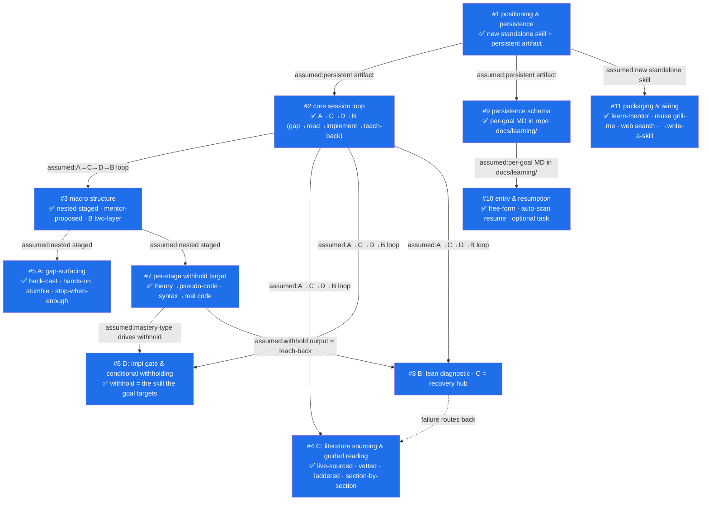

# Spec — `learn-mentor` skill

> Converged from `decision-graph.md` (11 resolved decisions).
> A learning-mentor skill whose posture is inverted from the rest of the ecosystem:
> it refuses to just-complete the task and instead drives the user to *truly master* a topic
> via the right papers/articles. Downstream: hand this spec to **write-a-skill** to build it.

## ⚠️ Unresolved Premises

None. All 11 decision nodes are resolved; no stale or skipped premises.

---

## What it is (one paragraph)

`learn-mentor` is a new standalone skill (`plugins/learn-mentor/…`) that, given a **learning goal + task**, decomposes the goal into stages and walks each stage through a four-phase loop — **A** surface gaps → **C** read the right literature → **D** implement to a stage goal → **B** teach-back — withholding exactly the skill the goal targets so the user reaches mastery by their own hand. It persists a per-goal knowledge map into the repo's `docs/learning/` so learning sediments with the project and resumes across sessions.

## Adopted decisions (dependency order)

1. **Standalone skill + persistent artifact** *(#1)* — chosen because true mastery needs cross-session accumulation; rejected an ephemeral mentor (restarts from zero) and a grill-me branch (different posture & artifact).

2. **Core loop A→C→D→B** *(#2)* — entry is the user's *goal + task*, not a known concept. A (Socratic) surfaces gaps the user can't name; C (guided reading) fills them; D (implementation) hits a stage goal; B (teach-back) confirms real understanding. Rejected a C-first ordering (presumes the user already knows what to study) and any single paradigm.

3. **Nested staged structure** *(#3)* — mentor decomposes the goal into N stages (mentor-proposed, user-confirmed), each bound to one implementable stage goal; A→C→D + a lightweight B run per stage, with a heavyweight B at the end. Two-layer B. Rejected flat single-pass (unfocused gaps, no anchor for the stage goal).

4. **C: live-sourced, vetted, laddered, section-by-section** *(#4)* — WebSearch + WebFetch (plus user-supplied URLs); a vetting rubric with a recorded "why chosen" per source; for each gap an **accessible explainer first, then the primary source**, read section-by-section with inline jargon/syntax/math decoding and per-section confirmation. Rejected direct primary-source assault (the #1 cause of give-up for a jargon-naive learner).

5. **A: back-cast + hands-on stumble + stop-when-enough** *(#5)* — back-cast prerequisites from the stage goal, make the user attempt/explain (gaps emerge from stumbles, since unknown-unknowns can't be self-assessed), stop once enough gaps to fill the stage are found. Output = a ranked gap list = C's agenda. Rejected mentor-lists-prerequisites/user-self-assesses.

6. **D: conditional withholding driven by the learning goal** *(#6)* — withhold *exactly the skill the stage goal targets*; supply the rest as scaffolding. Syntax goal → user writes the code (hint ladder, never a finished artifact). Theory goal → mentor may supply runnable plumbing. Stage goals carry acceptance criteria; a resurfaced gap loops back to C. Rejected absolute "user writes everything" (over-withholds when code is mere plumbing).

7. **Per-stage withhold target (mastery-type)** *(#7)* — tagged during decomposition, **per stage** (a goal mixes theory and implementation stages). Production bar: syntax → real working code; **theory → pseudo-code of the core mechanism** (which doubles as the stage's lightweight teach-back). D defaults to a real-task slice. Rejected a single global classification.

8. **B: lean diagnostic, C as recovery hub** *(#8)* — center of gravity is C; B is lean, not a gate. Light B reuses #7's withhold output + 1–2 "why/what-if" probes. Heavy terminal B walks the **seams between stages** (where synthesis breaks) but is diagnostic, not blocking. On failure → **mainly re-read C** (localize to source passage), not a full A/D re-run. Mastery states (unknown → reading → implemented → explained) are reversible. Rejected a heavyweight terminal exam as a hard gate.

9. **Persistence: per-goal Markdown in repo `docs/learning/`** *(#9)* — `docs/learning/<goal-slug>.md`, one file per goal, Markdown + embedded Mermaid (stage→gap→mastery map) + glossary table + mastery legend. Stores goal/task, stage decomposition (goal/criteria/withhold tag), per-stage gaps, chosen sources with "why", reading progress, glossary, mastery states, teach-back records. Created lazily. Rejected dual-mode and global-only (`~/.claude/learning/`) — learning sediments *with the project it serves*.

10. **Entry & cross-session resumption** *(#10)* — free-form "goal + task" prose; mentor parses and proposes a `<goal-slug>`. On start, scan `docs/learning/`: existing → auto-resume from the un-mastered frontier with a RESUME-style announcement; none → decompose. Task optional but strongly encouraged (gives D a real-task slice; pure theory degrades D to pseudo-code practice). Rejected rigid forms and a manual resume/restart prompt.

11. **Packaging: `learn-mentor`, reuse + compose** *(#11)* — A-phase reuses grill-me's interrogation prose; C uses WebSearch + WebFetch; no auto-coupling to record-adr; optional architecture-diagram for a polished panorama; downstream `spec.md` → **write-a-skill**. Learning nodes never graduate to ADR. Package as `plugins/learn-mentor/{.claude-plugin/plugin.json, skills/learn-mentor/SKILL.md}` + marketplace entry + `settings.json` enable. Rejected ADR coupling / a from-scratch interrogation engine.

---

## Final panorama

---

## Handoff

This spec is ready for **write-a-skill** to generate `plugins/learn-mentor/`. Optionally route through **to-prd** / **to-issues** first if you want a task breakdown.
